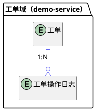
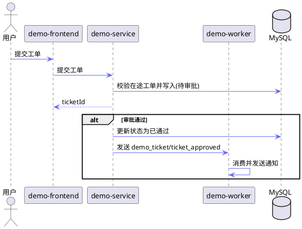

# detailed-design Examples

本文件存放 `detailed-design` 的长示例，避免主 `SKILL.md` 过长。所有示例使用中性场景「工单提交 → 审批 → 通知」，不绑定具体业务。

## 标题层级示例

````markdown
# 一、概要

## 1. 领域 ER 图
## 2. 重点流程（跨模块链路）
## 3. 模块间数据约定
## 4. 各模块入口程序

# 二、后端详细设计

## 二.1 demo-service

### 二.1.1 模块级澄清
#### 二.1.1.1 依赖项

### 二.1.2 领域层变更
#### 二.1.2.1 数据结构
##### 二.1.2.1.1 MySQL 表变更
##### 二.1.2.1.2 关键 JSON 结构

#### 二.1.2.2 领域提供的 Command
##### 二.1.2.2.1 TicketAggregate.CreateCmd

### 二.1.3 HTTP 接口
#### 二.1.3.1 提交工单
#### 二.1.3.2 工单详情

### 二.1.4 其它入口程序
#### 二.1.4.1 MQ 消费 `demo_ticket/ticket_approved`
#### 二.1.4.2 定时任务：关闭逾期待审批工单

# 三、前端详细设计

## 三.1 工单列表页
### 三.1.1 页面概述
### 三.1.2 组件树
### 三.1.3 组件详细设计

## 三.2 工单详情页
````

## ER 图样例



## 重点流程样例

调用新接口写中文名，调用已存在接口写完整 path：



## 模块间数据约定样例（MQ 消息体）

````markdown
## 3. 模块间数据约定

### 3.1 工单审批消息

- **Topic**: `demo_ticket`
- **Tag**: `ticket_approved`
- **消息体**:

```go
type TicketApprovedMsg struct {
    TicketId    int64 `json:"ticketId"`
    Status      int   `json:"status"`      // 2=已通过 3=已驳回
    ApproverUid int64 `json:"approverUid"`
    ApproveTime int64 `json:"approveTime"`
}
```
````

其它位置引用时仅用 topic/tag：`demo_ticket/ticket_approved`。

## 各模块入口程序样例

````markdown
### 4.1 demo-service

| # | 类型 | 接口/Topic | 用途 | 变更 |
|---|------|-----------|------|------|
| 1 | HTTP MIS | 提交工单 | 用户提交工单 | 新增 |
| 2 | HTTP MIS | `/demo/mis/ticket/approve` | 审批工单 | 修改：发送审批 mq |
| 3 | HTTP API | `/demo/api/ticket/status` | 查询工单状态 | 新增 |

### 4.2 demo-worker

| # | 类型 | 接口/Topic | 用途 | 变更 |
|---|------|-----------|------|------|
| 1 | MQ消费 | `demo_ticket/ticket_approved` | 审批结果通知 | 新增 |
````

## 领域层 Command 样例

````markdown
##### 1.2.2.1 TicketAggregate.CreateCmd

**Run 方法签名**
```go
func (a *CreateCmd) Run(ctx *gin.Context, in CreateIn) (out CreateOut, err error)
```

**结构体信息**
```go
type CreateCmd struct {
    In        CreateIn
    Out       CreateOut
    NowStamp  int64
    NewTicket models.TblTicket
}

type CreateIn struct {
    OwnerUID   int64  `json:"ownerUid"`
    TicketType int    `json:"ticketType"`
    Content    string `json:"content"`
}

type CreateOut struct {
    TicketID int64 `json:"ticketId"`
}
```

**调用方**

| 业务场景 | 调用方 |
|---|---|
| 用户提交工单 | `demo-service/service/ticket/ticket.go: SubmitTicket` |

**变更复杂度**: 低

**逻辑概述**:

| # | 修改类型 | 内容类型 | 概述 |
|---|---------|---------|------|
| 1 | 新增 | 逻辑分支 | 校验是否存在同类型在途工单 |
| 2 | 新增 | 数据事务 | 单事务写 `tblTicket`（状态置待审批）+ `tblTicketLog`（提交日志） |

**验证 case**
- WHEN 无同类型在途工单 THEN command SHALL 返回 `ticketId` 且工单状态收敛为 `待审批`
- IF 已存在同类型在途工单 THEN command SHALL 返回业务错误，不写库
````

## HTTP 接口样例（新增接口）

````markdown
#### 1.3.1 提交工单
- **PATH**: `/demo/mis/ticket/create`
- **METHOD**: POST (json)
- **API 平台链接**: （新增，待登记）
- **鉴权**: MIS user session
- **入参**:

| 字段 | 类型 | 必填 | 说明 |
|------|------|------|------|
| ticketType | int | 是 | 工单类型 |
| content | string | 是 | 工单内容 |

- **返回值**:

| 字段 | 类型 | 说明 |
|------|------|------|
| ticketId | int64 | 工单ID |
| status | int | 工单状态，1=待审批 |

**变更复杂度**: 低

**逻辑概述**:

| # | 修改类型 | 内容类型 | 概述 |
|---|---------|---------|------|
| 1 | 新增 | 逻辑分支 | 校验同类型在途工单，存在则拒绝 |
| 2 | 新增 | 数据事务 | 单事务写 `tblTicket` + `tblTicketLog` |

**入口验证case**:
- WHEN 请求参数合法且无在途同类型工单 THEN 系统 SHALL 返回 ticketId 且 status=1
- IF content 为空 THEN 系统 SHALL 返回参数错误
- IF 已存在同类型在途工单 THEN 系统 SHALL 拒绝并返回「已有处理中的同类型工单」
````

## 读接口样例（含字段数据来源核对）

````markdown
#### 1.3.2 工单详情
- **PATH**: `/demo/mis/ticket/detail`
- **METHOD**: GET
- **返回值**（★ 为依赖下游模块）:

| 字段 | 类型 | 说明 | 数据来源 |
|------|------|------|---------|
| status | int | 工单状态 | 本地 `tblTicket` |
| ownerName | string | 提交人姓名 | ★ user-service `/user/api/name/batch` |

> 字段依赖核对结论：返回值依赖 1 个下游模块接口（user-service），见下方逻辑概述节点 2。

**变更复杂度**: 低

**逻辑概述**:

| # | 修改类型 | 内容类型 | 概述 |
|---|---------|---------|------|
| 1 | 新增 | io-mysql | 读 `tblTicket` 取工单详情 |
| 2 | 新增 | io-接口 | 调用 `/user/api/name/batch` 刷 ownerName |

**入口验证case**:
- WHEN 工单存在 THEN 系统 SHALL 返回工单详情及提交人姓名
- WHEN 工单不存在 THEN 系统 SHALL 返回空数据
````

## 其它入口程序样例（MQ 消费）

````markdown
#### 1.4.1 MQ 消费：审批消息 `demo_ticket/ticket_approved`

（消息体见概要 §3.1）

**变更复杂度**: 中

**逻辑概述**:

| # | 修改类型 | 内容类型 | 概述 |
|---|---------|---------|------|
| 1 | 新增 | 逻辑分支 | 解析消息，判断 status 是通过还是驳回 |
| 2 | 新增 | io-接口 | 调用通知服务发送对应通知 |
| 3 | 新增 | io-mysql | 写 `tblTicketLog` 记录通知发送结果 |

**入口验证case**:
- WHEN 收到 status=2 的审批消息 THEN 系统 SHALL 发送通过通知
- WHEN 收到 status=3 的审批消息 THEN 系统 SHALL 发送带驳回原因的通知
````

## 依赖项样例

```markdown
| 依赖 | 说明 |
|------|------|
| `/user/api/name/batch` | 批量查询用户姓名 |
| `/notify/api/send` | 发送站内通知 |
| Redis 分布式锁 | `ticket:approve:{ticketId}`，TTL 10s |
```

---

## 前端组件详细设计样例

> 前端按「页面 → 组件树 → 逐组件」展开。

### 页面概述与组件树样例

````markdown
## 三.1 工单列表页

### 三.1.1 页面概述
- **路由**: `/ticket/list`
- **用途**: 展示当前用户的工单列表，支持按类型/状态筛选与提交新工单
- **入口来源**: 顶部导航「我的工单」
- **对应需求**: Req 1 工单提交与状态模型

### 三.1.2 组件树

| 组件文件 | 父组件 | 作用 | 修改类型 |
|---|---|---|---|
| `index.vue` | - | 页面主容器 | 新增 |
| `components/FilterPanel.vue` | `index.vue` | 条件筛选 | 新增 |
| `components/TicketTable.vue` | `index.vue` | 列表展示 | 复用 |
| `components/SubmitDialog.vue` | `index.vue` | 提交工单弹窗 | 新增 |
````

### 逐组件详细设计样例

````markdown
### 三.1.3 组件详细设计

#### 三.1.3.1 SubmitDialog.vue

**Props**

| 名称 | 类型 | 必填 | 说明 |
|---|---|---|---|
| visible | boolean | 是 | 控制弹窗显隐 |
| ticketTypes | array | 是 | 可选工单类型列表 |

**Emits/事件**

| 事件名 | 载荷 | 触发时机 |
|---|---|---|
| submitted | { ticketId } | 提交成功后 |
| close | - | 关闭弹窗时 |

**本地状态**
- `form`: { ticketType, content }
- `submitting`: 提交中标志，防重复提交

**接口调用**

| 接口 path | 后端章节 | 触发时机 | 关键入参 | 用到的返回字段 |
|---|---|---|---|---|
| `/demo/mis/ticket/create` | §二.1.3.1 | 点击「提交」 | ticketType, content | ticketId, status |

**交互逻辑**

| # | 概述 |
|---|------|
| 1 | 打开弹窗时重置 form 与 submitting |
| 2 | 点击提交先做必填校验，缺失则高亮并阻断 |
| 3 | 校验通过后置 submitting=true 调用创建接口 |
| 4 | 成功 emit submitted 并关闭；失败展示后端返回的错误文案 |

**前端验收点**
- WHEN 用户未填 content 点击提交 THEN 弹窗 SHALL 高亮 content 并提示「请填写工单内容」
- WHEN 创建接口返回成功 THEN 弹窗 SHALL 关闭且列表刷新出现新工单
- IF 创建接口返回「已有处理中的同类型工单」 THEN 弹窗 SHALL 原样展示该错误文案且不关闭
- WHILE 提交请求进行中 THEN 提交按钮 SHALL 置灰防重复点击
````
