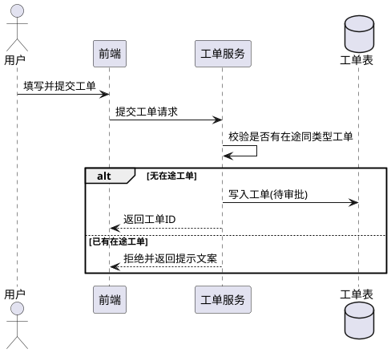
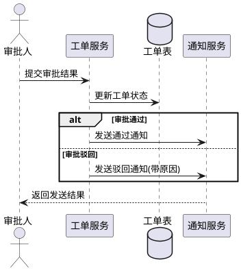
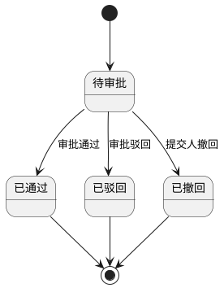
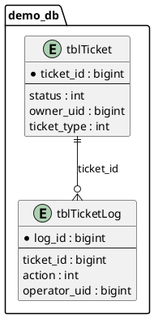

# 概要设计示例

> 本文件是 `outline-design` 的完整输出风格范例，使用中性场景，不绑定具体业务。
>
> 前置确认流程建议：
> 1. 第一个 `AskUserQuestion`：**必问**，只确认输入材料与输出方式
> 2. 第二个 `AskUserQuestion`：**按需**，仅在前端页面归属不明确时确认页面放在哪个模块
> 3. 第三个 `AskUserQuestion`：**按需**，仅在后端表结构/领域归属不明确时确认表结构变更放在哪个模块

## 一 可行性分析

### 1.1 重点流程

> `1.1 重点流程` 推荐拆成多张 PlantUML **时序图**，每张图只表达一个需要多模块协作的重点功能，不要把所有流程合并成一张总图。

#### 1.1.1 工单提交流程

#### 1.1.2 审批与通知流程

### 1.2 状态机

---

## 二 前端方案

### 2.1 页面变更

| 模块 | 修改类型 | 页面名称 | path |
|---|---|---|---|
| demo-frontend | 新增 | 工单列表页 | `/ticket/list` |
| demo-frontend | 修改 | 工单详情页 | `/ticket/detail` |

### 2.2 页面详情

#### 2.2.1 工单列表页

**组件拆分**

| 模块 | 组件文件 | 作用 | 修改类型 |
|---|---|---|---|
| demo-frontend | `index.vue` | 页面主容器 | 新增 |
| demo-frontend | `components/FilterPanel.vue` | 条件筛选区域 | 新增 |
| demo-frontend | `components/TicketTable.vue` | 工单列表展示 | 复用 |

#### 2.2.2 工单详情页

**组件拆分**

| 模块 | 组件文件 | 作用 | 修改类型 |
|---|---|---|---|
| demo-frontend | `detail.vue` | 详情容器 | 修改 |
| demo-frontend | `components/StatusCard.vue` | 状态展示卡片 | 新增 |
| demo-frontend | `components/ApproveDialog.vue` | 审批操作弹窗 | 新增 |

---

## 三 后端方案

### 3.1 ER图

### 3.2 模块变更详细说明

| 模块 | 变更类型 | 变更内容 |
|---|---|---|
| demo-service | 新增 | 新增 service/ticket、dto/dtoticket、controllers/ticket 三部分 |
| demo-worker | 修改 | 增加审批结果通知的异步消费逻辑 |

### 3.3 接口概览

| 模块 | 分类 | 接口名 | path | 变更类型 |
|---|---|---|---|---|
| demo-service | 前后端HTTP接口 | 提交工单 | /demo/mis/ticket/create | 新增 |
| demo-service | 前后端HTTP接口 | 工单详情 | /demo/mis/ticket/detail | 新增 |
| demo-service | 后端RPC接口 | 查询工单状态 | /demo/api/ticket/status | 新增 |
| demo-service | 后端MQ异步消息 | ticket_approved | demo_ticket / ticket_approved | 新增 |

---

## 四 接口文档

### 4.1 前后端HTTP接口

#### 4.1.1 提交工单

**模块**: demo-service
**METHOD**: POST (json)
**PATH**: `/demo/mis/ticket/create`
**API 平台链接**: https://example.api-platform.local/project/1/interface/api/1001

**入参**:

| 字段 | 类型 | 必填 | 变更类型 | 说明 |
|---|---|---|---|---|
| ticketType | int | 是 | 新增 | 工单类型 |
| content | string | 是 | 新增 | 工单内容 |

**返回**:

| 字段 | 类型 | 变更类型 | 说明 |
|---|---|---|---|
| ticketId | int | 新增 | 工单ID |
| status | int | 新增 | 工单状态，1=待审批 |

### 4.2 后端RPC接口

#### 4.2.1 查询工单状态

**模块**: demo-service
**METHOD**: POST
**PATH**: `/demo/api/ticket/status`

**入参**:

| 字段 | 类型 | 必填 | 变更类型 | 说明 |
|---|---|---|---|---|
| ticketId | int | 是 | 新增 | 工单ID |

**返回**:

| 字段 | 类型 | 变更类型 | 说明 |
|---|---|---|---|
| status | int | 新增 | 工单状态 |

### 4.3 后端MQ异步消息

#### 4.3.1 ticket_approved

**Topic**: `demo_ticket`

**Tag**: `ticket_approved`

**生产者**: demo-service

**消费者**: demo-worker

**消息体**: 包含 `ticketId`、`status`、`approverUid`、`approveTime`
