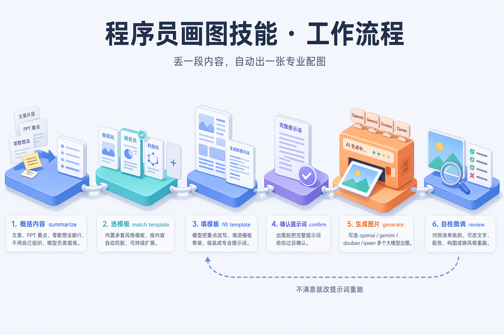
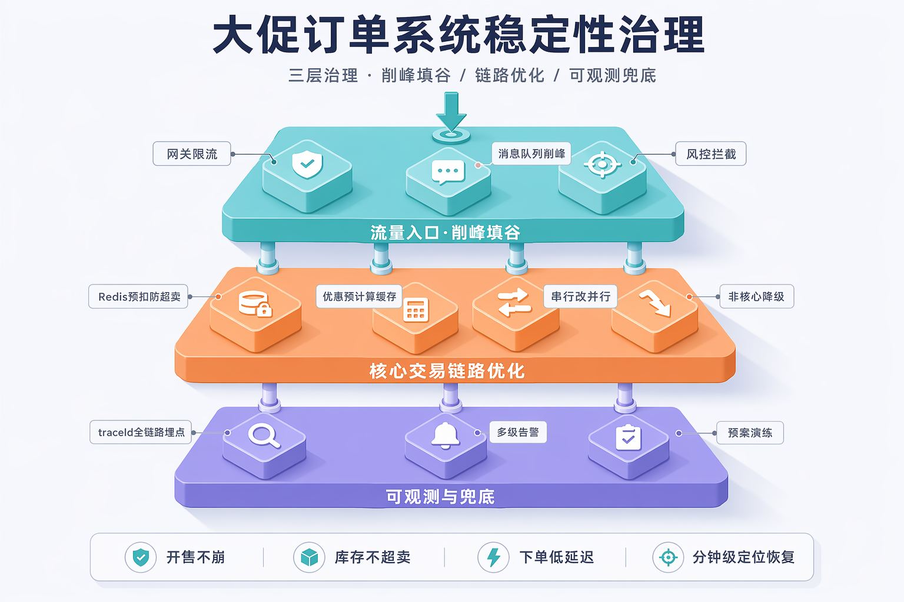
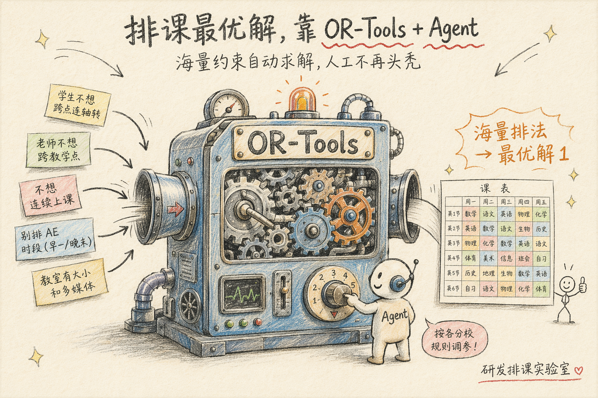

# 程序员画图（技术配图生成）

把技术内容（文章、PPT 要点、架构、观点、数据）变成专业好看的配图。核心思路：**不让你硬写提示词**，而是由模型替你选一套打磨好的模板、填空、调出图 API。

## 配置

配置是一个 `active` + `providers` 的 map 结构：把 `active` 设成要用的通道，再在 `providers` 里给那一家填对应 key（`base_url`、`model` 已内置各家官方默认，通常无需改）。

复制 `config.example.json` 为 `config.json` 后填写：

| 通道 | `active` 值 | 需要填的 key | 说明 |
|---|---|---|---|
| GPT / OpenAI 图像（默认） | `openai` | `api_key` | 官方或任意 OpenAI 兼容网关的 key；`base_url` 默认官方，用网关时改它即可 |
| Gemini / Nano Banana | `gemini` | `api_key` | 走 chat/completions 兼容网关；排版/多元素一致性强，**中文渲染最准、复杂图首选** |
| 豆包 / Seedream | `doubao` | `api_key` | 火山方舟 Ark，国内官方；构图美观，中文偶有错字 |
| 千问 / qwen-image | `qwen` | `api_key` | DashScope multimodal 兼容网关；复杂结构化中文图指令遵循较弱 |

> `config.json` 已被 `.gitignore` 忽略，不会上传。

## 怎么使用

使用 `programmer-illustration` 技能，直接把要画的内容丢给我即可：

`你要生成图片的文案：……`

我会替你选风格 → 填模板 → 给你确认提示词 → 出图 → 自检后交付。

## 工作流程



本 skill 把一段技术内容变成一张配图，分 6 步：

1. **概括内容** — 把你丢来的内容提炼成主题和要点
2. **选模板** — 按内容特征匹配最合适的风格模板（默认由我来选，不用你硬挑）
3. **填模板** — 把内容填进模板骨架，保留该风格的色板与质感
4. **确认提示词** — 把拼好的完整提示词给你过目确认，再花钱出图
5. **生成图片** — 调用大模型出图
6. **自检微调** — 对照清单自查，不合格就改提示词重跑（闭环）

> 上面这张流程图本身就是用本 skill 的「等距立体风」模板生成的。

## 五种风格 & 样图

每种风格的效果样图就放在对应模板文件旁（`templates/<风格名>.png`），打开模板即可看到。

| 风格 | 模板 | 样图 |
|---|---|---|
| 科技插画风 | `templates/科技插画风.md` |  |
| 暗色科技风 | `templates/暗色科技风.md` |  |
| 等距立体风 | `templates/等距立体风.md` |  |
| 数据卡片风 | `templates/数据卡片风.md` |  |
| 手绘涂鸦风 | `templates/手绘涂鸦风.md` |  |

## 命令行直接出图（可选）

```bash
python scripts/generate.py \
  --prompt "<完整提示词>" \
  --ratio 16:9 \
  --style 科技插画风 \
  --title 实时风控决策引擎 \
  --provider doubao   # openai | gemini | doubao | qwen，省略则读 config 的 active
# 出图默认落在「当前工作目录」，文件名为「风格-标题.png」；也可加 --out 指定文件名或路径
```
