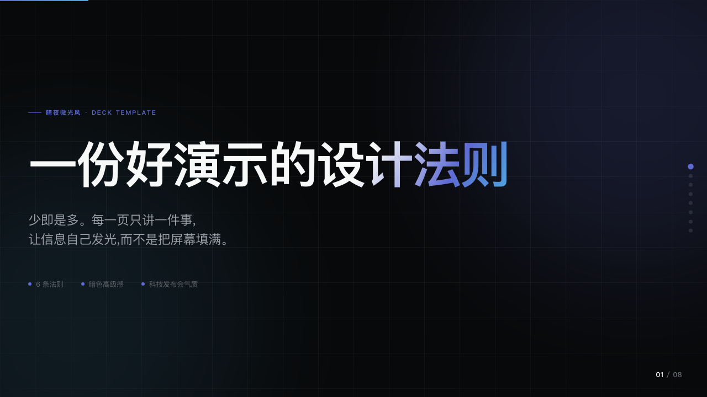
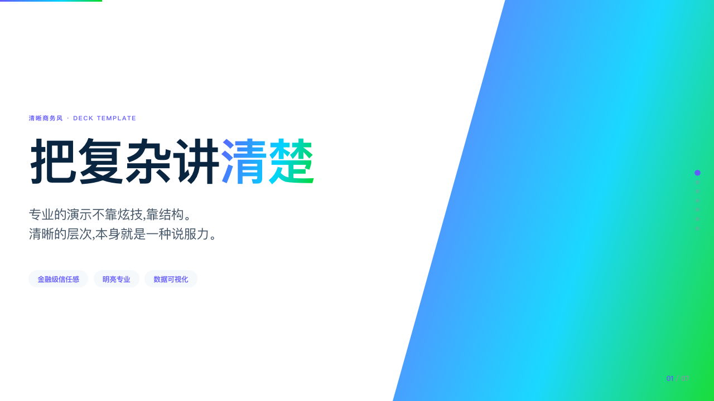
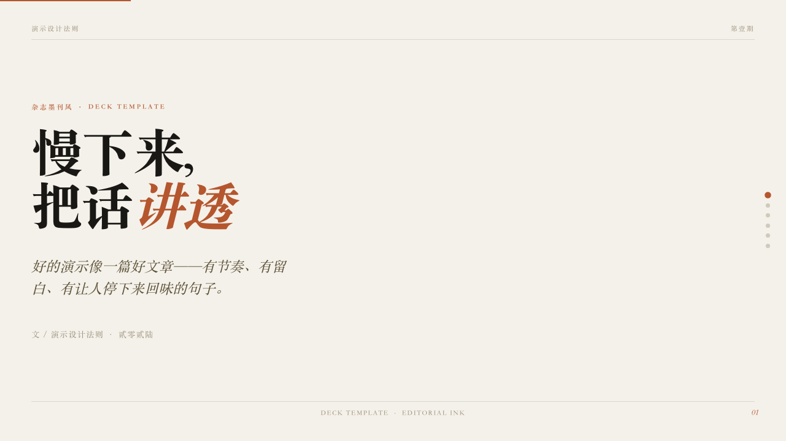
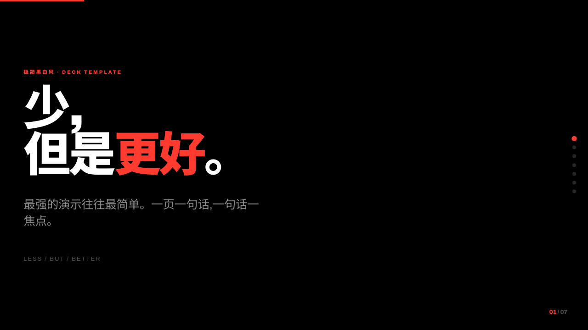
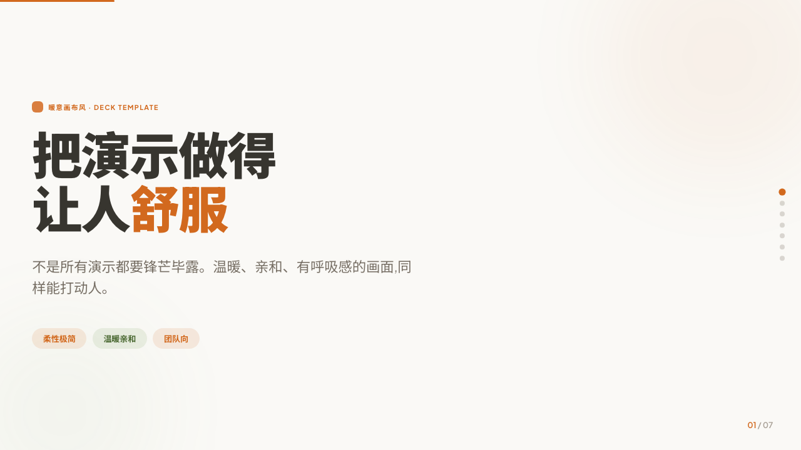
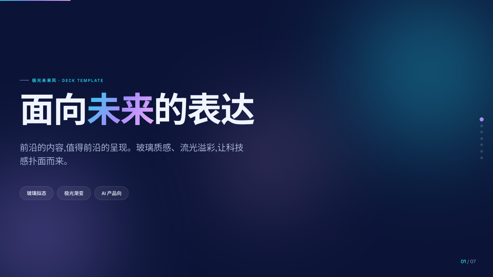

# Tech Deck（技术演示文稿生成）

把技术内容（文章、PPT 要点、架构、观点、数据）变成业内顶尖水准的 HTML 演示文稿。核心思路：**不让你硬写、硬选**，而是由模型分析内容气质 → 推荐模板 → 逐页确认大纲 → 生成单文件 HTML → 自动校验。

零依赖、单文件、浏览器直接打开。

## 怎么使用

使用 `tech-deck` 技能，直接把要做演示的内容丢给我即可：

`帮我把这篇内容做成演示：……`

我会替你分析气质 → 推荐主推+备选模板 → 列大纲让你逐页确认 → 生成 → 自检后交付。

## 工作流程

本 skill 把一段技术内容变成一份演示文稿，分 6 步：

1. **接收内容** — 分析主题、受众、长度、气质
2. **AI 推荐模板** — 主推 1 套 + 备选 1 套并说明理由，只生成主推预览（不全量预览）
3. **列大纲** — 逐页列出标题、内容、推荐版式，你可逐页调整
4. **生成** — 读取模板规格 + 版式目录 + 布局铁律，构建完整 HTML
5. **校验** — 多分辨率截图检查无溢出、导航正常
6. **交付** — 打开文件，说明定制方法

## 六套模板 & 样例

每套模板都是**完整视觉语言**（色彩 + 空间 + 字体 + 偏好版式 + 动画 + 翻页），不是单纯换配色。规格见 `templates/<名>.md`，效果样例见同名 `.html`（可直接打开滚动浏览），首页截图见 `.png`。

| 模板 | 对标 | 气质 | 样例首页 |
|---|---|---|---|
| 暗夜微光风 | Linear/Vercel | 暗色高级、科技发布会 |  |
| 清晰商务风 | Stripe | 金融级信任、明亮专业 |  |
| 杂志墨刊风 | Kinfolk 杂志 | 文艺有格调、深度叙事 |  |
| 极简黑白风 | Apple Keynote | 极致对比、自信有力 |  |
| 暖意画布风 | Notion/Things | 柔性极简、温暖亲和 |  |
| 极光未来风 | AI 产品 | 未来感、惊艳 |  |

> 每个 `.html` 样例本身就是用对应模板做的，内容是抽象的「演示设计法则」，可作为该模板真实效果的参照。

## 约 23 种版式（逐页可选）

版式与模板正交：模板管「整体长什么样」，版式管「这一页内容怎么排」。同一版式在不同模板下呈现各自气质。完整目录见 `templates/_版式目录.md`，按内容类型分 8 类：

开场过渡 · 罗列信息 · 对比 · 数据 · 结构关系 · 叙事 · 专项 · 收尾

列大纲时，我会为每页推荐合适的版式，你可逐页替换（如「第 3 页换成数据仪表」）。

## 布局质量铁律

无论哪套模板，强制遵守（见 `templates/_布局铁律.md`）：

1. **每页一个视觉焦点** — 不平铺，用大小/留白/颜色制造主次
2. **大字号** — 标题 `clamp(2.5rem, 7vw, 6rem)` 起，正文 ≥ `0.95rem`
3. **重点高亮** — 关键词加色/加重，绝不全是灰字
4. **留白优先** — 内容少而精，宁可拆页
5. **视口适配** — 每页恰好一屏，绝不内部滚动

## 操作

生成的 HTML 用方向键 / 滚轮 / 触摸滑动翻页，右侧导航点可跳转，顶部进度条显示进度。
